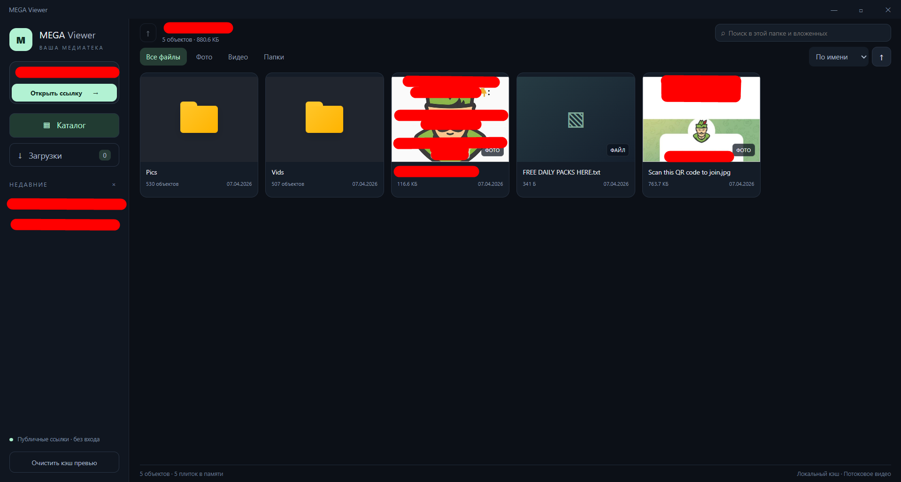

# MEGA Viewer 1.2.2

Windows x64-приложение для публичных ссылок MEGA.nz. Electron + MEGAJS, русский тёмный интерфейс, без входа в аккаунт. Веб-страницы MEGA не парсятся.



Скриншот приложения: папки находятся в категории «Все файлы». Названия папок и файлов на снимке приведены для примера.

## Быстрый старт

1. Закройте ранее запущенный MEGA Viewer.
2. Откройте **MEGA-Viewer-Setup-1.2.2.exe** и выберите папку установки.
3. Запустите приложение через ярлык на рабочем столе или в меню «Пуск».
4. Вставьте полную публичную ссылку MEGA в поле слева и откройте её.
5. Откройте жёлтую плитку папки в категории **«Все файлы»** и нажмите на фото или видео.

Для установленной версии Node.js не нужен. Нужны Windows x64 и доступ к интернету. Удаление приложения доступно через параметры Windows.

### Запуск через BAT

1. Распакуйте **весь** архив исходников в отдельную папку.
2. Установите Node.js 22 или новее с npm: [nodejs.org](https://nodejs.org/).
3. Откройте **Запустить.bat** из распакованной папки.

При первом запуске зависимости и Electron загрузятся автоматически. Не запускайте BAT прямо внутри ZIP. Если Node.js установлен только что, закройте окно BAT и откройте его заново.

## Версия 1.2.2

- Папки отображаются жёлтыми плитками в основной сетке вместе с файлами. Папки идут первыми при любой сортировке.
- Список папок в боковом меню убран. Переходы выполняются через плитки, путь над каталогом и кнопку **«На уровень выше»**.
- При открытии папки поисковый запрос и фильтр сбрасываются на «Все файлы», чтобы сразу показывать её содержимое.
- Ссылка на вложенную папку открывает выбранную папку, при этом можно подняться к корню публичной ссылки и открыть соседние папки.
- В README добавлен один скриншот нового интерфейса.

Демонстрационный режим удалён в версии 1.2.1 и отсутствует в этой версии. При запуске приложение ожидает публичную ссылку MEGA.

## Возможности

- Тёмный интерфейс с собственной компактной верхней панелью, без стандартного меню Electron.
- Публичные ссылки на файлы и папки, навигация по папкам в основной сетке, поиск и история последних ссылок.
- Встроенный просмотр фотографий и видеоплеер; сортировка по имени, дате, размеру и типу; фильтры фото/видео/папки.
- **ПКМ по файлу → «Скачать файл…»**: выбор имени и папки сохранения. Кнопка скачивания также есть в плеере.
- **«Загрузки» слева**: очередь, прогресс, скорость, отмена, повтор и «Показать в папке». История сохраняется между запусками. Одновременно скачивается один файл. При открытом просмотрщике очередь ждёт, чтобы не конкурировать с воспроизведением; после закрытия продолжает работу.
- **Шесть колонок** с виртуализацией и компактным управлением над каталогом.
- **Более качественные превью**: сначала используется крупный preview MEGA (тип 1), затем обычная миниатюра. Кэш и резервный кадр до 640 пикселей по ширине, JPEG 92%. Маленькие серверные изображения не увеличиваются искусственно. Старый кэш с низким качеством автоматически перестаёт использоваться.
- **Плеер**: выдача первых байтов до полной загрузки блока; повторное использование адреса MEGA; максимум три сетевых запроса; ограниченный кэш в RAM; одна повторная попытка при временном сбое; кнопка повторной загрузки и понятное сообщение при долгом ожидании.
- Для некоторых MP4 с множеством отдельных областей `mdat` исправлен долгий первоначальный просмотр структуры файла браузером. Изменяется только виртуальный поток воспроизведения, позиции и содержимое медиасэмплов сохраняются. **При скачивании оригинальный файл не изменяется.**

## Использование

Вставьте полную публичную ссылку с ключом после `#` в боковую панель. Поддерживаются файлы, папки и ссылки на вложенные объекты, современные `/file/`, `/folder/` и старые форматы `#!`, `#F!`.

Слева находятся поле ссылки, каталог, история последних 20 ссылок и раздел загрузок. Папки отображаются в основной сетке: в категории «Все файлы» вместе с файлами, в категории «Папки» отдельно. Выбранная сортировка применяется внутри двух групп: сначала папки, затем файлы.

Путь над каталогом позволяет перейти к любой родительской папке. Стрелка ↑ слева от пути поднимает на один уровень; в корне публичной ссылки она недоступна. Поиск работает в текущей папке и всех вложенных. Переход в другую папку очищает поиск и включает «Все файлы».

| Действие | Управление |
| --- | --- |
| Открыть папку | Нажать на жёлтую плитку папки |
| Вернуться на уровень выше | Кнопка ↑ слева от пути над каталогом |
| Перейти к корню или другой родительской папке | Нажать на её название в пути над каталогом |
| Открыть фото или видео | Нажать на плитку файла |
| Предыдущее / следующее медиа | Клавиши ← / → в просмотрщике |
| Закрыть просмотрщик | Escape |
| Скачать файл | Правая кнопка мыши по файлу → «Скачать файл…» |
| Проверить скачивание | Раздел «Загрузки» слева |

## Работа загрузок

Файл записывается во временный `.part` рядом с выбранным местом назначения. Готовый файл появляется после завершения, проверки размера и проверки целостности MEGAJS. При отмене/ошибке временный файл удаляется, существующий файл назначения сохраняется. Замена выбранного существующего файла подтверждается системным диалогом сохранения.

Закрытие приложения отменяет текущую очередь; автоматического продолжения с последнего байта после перезапуска нет. Повтор внутри текущего сеанса начинает загрузку заново. После перезапуска для прерванного файла снова выберите скачивание в каталоге. Скачанные файлы автоматически не запускаются.

## Если что-то не работает

| Ситуация | Что сделать |
| --- | --- |
| Ссылка не открывается | Скопируйте её полностью, включая ключ после `#`. Проверьте, что владелец не удалил ссылку и она не защищена паролем. |
| Каталог долго открывается | Дождитесь получения списка файлов: для большой папки метаданные загружаются целиком до отображения каталога. |
| По ссылке открылись только видео, а нужны соседние папки | Если ссылка ведёт во вложенную папку, нажмите ↑ над каталогом или название корня в пути. |
| Видео долго загружается | Воспользуйтесь кнопкой повторной загрузки в плеере. Проверьте доступность файла и лимит трафика MEGA. |
| Видео не воспроизводится | Скачайте оригинал через контекстное меню и откройте установленным видеоплеером: встроенный плеер поддерживает не все кодеки. |
| Превью размыто или отсутствует | Качество зависит от доступных изображений в MEGA. Приложение сначала запрашивает крупное превью, затем использует миниатюру или резервный кадр. |
| Загрузка ожидает закрытия плеера | Закройте просмотрщик — очередь продолжится автоматически. |
| Ошибка `EBLOCKED` | MEGA блокирует выдачу файла; повторная установка приложения это не исправит. |
| BAT сообщает, что Node.js или npm не найден | Установите Node.js с npm и повторно откройте BAT. |

## Ограничения

- MEGAJS 1.3.10 — неофициальный SDK, официальный C++ SDK не используется. Документация: https://mega.js.org/docs/1.0/api.
- Метаданные публичной папки сначала запрашиваются целиком. Лениво загружаются плитки и медиа; это не постраничный запрос самого каталога.
- Качество превью зависит от того, какие изображения сохранил владелец в MEGA. Получение первого кадра при отсутствии готового превью расходует трафик; тайм-аут 25 секунд. Резервное автопревью фото больше 32 МБ отключено, но само фото можно открыть.
- Хорошо поддерживаются JPEG, PNG, WebP, GIF, AVIF, MP4 H.264/AAC и WebM VP8/VP9. MOV, MKV, AVI зависят от кодеков Chromium; HEIC, RAW и неподдерживаемые кодеки не конвертируются.
- Лимиты трафика, блокировки файлов и скорость MEGA сохраняются. `EBLOCKED` означает отказ сервера. Недоступные/защищённые паролем ссылки и вход в аккаунт не поддерживаются.
- Дата берётся из MEGA, это не EXIF. Для отдельного публичного файла даты может не быть. Размеры папок рекурсивно не суммируются.

## Данные и архитектура

- `main.cjs`: MEGA, локальный сервер, IPC, системное меню и окно. Сервер слушает только `127.0.0.1`, использует случайный секрет, HTTP Range и отмену запросов. Запросы к MEGA — HTTPS.
- `downloads.cjs`: очередь, сохранение и история загрузок. `download-url.cjs`: краткосрочный кэш адресов MEGA.
- `media-cache.cjs`: постепенная выдача данных, повторы и RAM-кэш до 96 МБ. `mp4-stream.cjs`: узкая оптимизация нефрагментированных MP4 с ранним `moov` и соседними `mdat`; остальные контейнеры не меняются.
- `thumbnail.cjs`: получение и расшифровка файловых атрибутов MEGA, протокол из https://github.com/meganz/webclient/blob/master/js/crypto.js.
- `preload.cjs`: ограниченный мост IPC. Renderer работает без Node.js, с sandbox и context isolation. Внешняя навигация, новые окна и запросы разрешений заблокированы.
- `renderer.js`, `index.html`, `style.css`: галерея, плеер, очередь превью и раздел загрузок.

Данные приложения: `%APPDATA%\mega-viewer\`. История ссылок с ключами шифруется Electron safeStorage/Windows DPAPI (`history.enc`). Превью (`thumbnails`) и история скачиваний с локальными путями (`downloads.json`) **не шифруются**. Кэш превью очищается до 256 МБ при запуске и раз в минуту. В RAM — до 150 изображений превью. Видеобуфер хранится только в RAM и очищается при смене плеера. На диск сохраняются только явно скачанные пользователем оригиналы.

## Разработка и проверки

```powershell
npm ci
npm start
npm test
npm run smoke
npm run test:ui
npm run build:installer
```

`npm run build` также создаёт portable EXE. Результаты сборки — `dist/`.

`npm run smoke` открывает настоящее окно Electron в отдельном тестовом профиле и проверяет пустой каталог, загрузку интерфейса, IPC и переходы между каталогом и разделом загрузок. Скриншот: `%TEMP%\mega-viewer-smoke.png`. Пользовательский профиль не меняется.

`npm run test:ui` проверяет навигацию по плиткам и пути, вложенные ссылки, сортировку с папками в начале, поиск, фильтры, шесть колонок и прокрутку каталога из 1000 папок в настоящем окне Electron. Тест использует отдельный профиль и метаданные из `test/catalogue-ui.cjs`; они не включаются в установленное приложение. Снимок сохраняется в `%TEMP%\mega-viewer-catalogue.png`. Команда `npm run test:ui -- --screenshot-docs` обновляет `docs/screenshot.png` для README.

17 модульных тестов проверяют диапазоны, вложенные ссылки, сохранение/отмену скачивания, защиту существующего файла, повторное чтение блоков, отдачу первых байтов, восстановление после обрыва и ограничение MP4-оптимизации подходящими файлами.

Для живого теста задайте `MEGA_TEST_URL` и запустите `npx electron . --live-test`. `MEGA_EXTENDED_TEST=1` добавляет 20 секунд воспроизведения, перемотку и несколько MP4; `MEGA_VIDEO_INDEX` выбирает первый проверяемый MP4. Пользовательские ссылки, ключи и медиа не включаются в поставку. В версии 1.2.2 проверена публичная ссылка на вложенную папку: загружены 500 объектов общей папки, переход наверх показал две папки, видео начало загружаться примерно за 2,3 секунды; проверенный JPG сервер блокировал с `EBLOCKED`. Скорость зависит от соединения и файла.

## Идеи для следующих версий

Перечисленные ниже возможности пока не реализованы:

- Продолжение видео с последней позиции и отметки «Просмотрено».
- Избранное и собственные коллекции из разных ссылок.
- Множественный выбор, скачивание группы файлов и папки с сохранением структуры.
- Возобновление скачивания после перезапуска и ограничение скорости.
- Несколько кадров видео при наведении на плитку.
- Фильтры по длительности и разрешению видео.
- Настройки размера плиток, лимита кэша и горячих клавиш.

## Лицензия

MIT, см. LICENSE. Это не официальный продукт MEGA. Лицензии зависимостей находятся в npm-пакетах.
